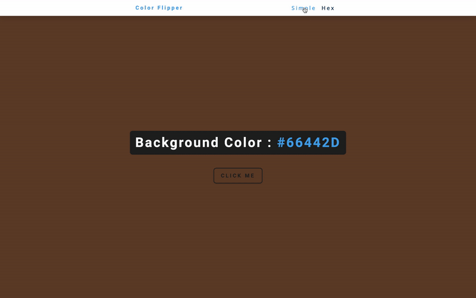
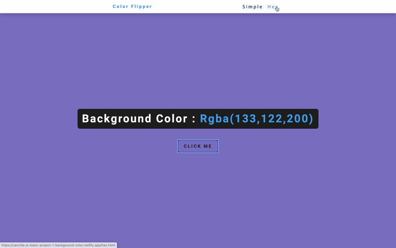

# Color Flipper

<!-- This is an example. These only work on Public Repo's -->


Color Flipper is a tool that allows a user to do change the background of the page by a click of button.

Your project can be styled according to your team's taste and what you invision for the persona that was selected.

This application has two modes: Simple and Hex.

- Simple View : If the application is in simple mode when the user clicks the button, the background color will be chosen by a predetermined colors.
  
  

- Hex View: If the user is in hex mode, the color that will show after the button it pressed will be a completely random hex code color.
  
  

## Installing Color Flipper

To install Color Flipper, follow these steps:

```
git clone <ADD_URL_HERE>
```

## Using Color Flipper

To use Color Flipper, follow these steps:

```shell
hs -o setup/index.html
```

## Acceptence Criteria
1. Senario 1
    - **User story:** As a user, I want to be able to randomly select a color so that the background color of the page can be changed.
    - **Given:** The user has navigated to the home page
    - **When:** The user presses a button that reads “Click Me” on in the center of the page
    - **Then:** A random color should be chosen from a predetermined array of colors
    - **And:** The background color of the current page’s body should be changed to the chosen color
1. Senario 2
    - **User story:** As a user, I want to be able to know exactly what background color has been chosen for the page’s bod.
    - **Given:**  The user has navigated to any page
    - **When:** The user wants to see what color is being displayed
    - **Then:** Above the “Click Me” button the background color’s text representation should be displayed
1. Senario 3
    - **User story:** As a user, I want to be able to know where they are within the application
    - **Given:**  The user is on any page
    - **When:** The user wants to know what page they are on
    - **Then:** The name of the page they are on should be displayed somewhere on the screen.
1. Senario 4
    - **User story:** As a user, I want to be able to navigate to any other available pages
    - **Given:**  The user is on any page
    - **When:** The user wants to navigate to the hex page, or the simple page
    - **Then:** The user should be able to click on a link in the Navbar that will take them to the correct page
1. Senario 5
    - **User story:** As a user, I want to be able to randomly change the background color of the page to any hex code color.
    - **Given:**  The user has navigated to the home page
    - **When:** The user presses a button on in the center of the page
    - **Then:** A random color should be chosen from a predetermined array of colors
    - **And:** The background color of the current page’s body should be changed to the chosen color
